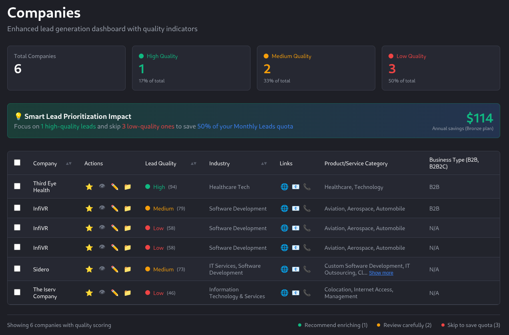

# Lead Quality Indicator Enhancement

## Overview
This project enhances SaaSquatch Leads by adding a **Lead Quality Indicator** feature that helps users maximize their Monthly Lead quota by identifying which leads are worth enriching before spending their allocation.



## Business Value
- **Save Monthly Lead Quota**: Skip low-quality leads to preserve subscription value
- **Increase ROI**: Focus enrichment budget on high-converting prospects  
- **Faster Decision Making**: Visual quality indicators eliminate manual assessment
- **Smart Prioritization**: Data-driven lead selection based on proven business criteria

## Key Features

### Lead Quality Scoring
- **🟢 High Quality (80-100)**: Recommend enriching - strong conversion potential
- **🟡 Medium Quality (60-79)**: Review carefully before enriching  
- **🔴 Low Quality (<60)**: Skip to save Monthly Lead quota

### Enhanced Dashboard
- Exact visual match to SaaSquatch interface
- Sortable Lead Quality column with score details
- Interactive quality indicators with tooltips
- Summary cards showing quality distribution
- ROI impact calculator showing potential savings

## Technical Implementation

### Tech Stack
- **Frontend**: React 19 + TypeScript + Vite
- **Styling**: Inline CSS
- **Architecture**: Component-based with shared utilities

### Project Structure
```
src/
├── components/     # React components with inline CSS
├── data/           # Mock lead data and utilities
└── utils/          # Scoring algorithm
```

## Getting Started

### Prerequisites
- Node.js 18+
- pnpm package manager

### Installation
```bash
# Install dependencies
pnpm install

# Start development server
pnpm run dev

# Build for production
pnpm run build

# Run linting
pnpm run lint
```

## Demo Scenario

The application includes sample data showcasing:
- **2 High Quality leads** (Third Eye Health, InfiVR) - Healthcare Tech and Software Development
- **3 Medium Quality leads** - Mixed industries requiring review
- **1 Low Quality lead** (Sidero) - IT Services without clear B2B focus

This demonstrates how users can immediately identify which leads deserve their precious Monthly Lead allocation.

## Development Notes

### Scoring Algorithm
Located in `src/utils/scoring.ts`, the algorithm is designed to be:
- **Simple but effective**: Easy to understand and maintain
- **Extensible**: New criteria can be added easily
- **Transparent**: Score rationale visible to users

### Component Architecture
- `LeadTable`: Main table component with sorting and interactivity
- `App`: Layout and summary statistics
- Type-safe interfaces ensure data consistency
